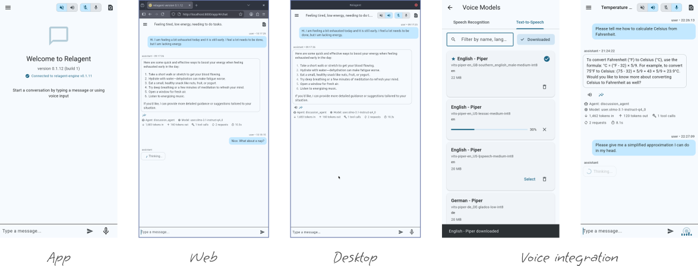

# Relagent

<div align="center">


*A trustworthy AI-powered private assistant for daily use that keeps you in control over your data.*

**\#PrivacyFirst - \#SelfHosting - \#DataSovereignty - \#DigitalIndependence**

<a href="https://f-droid.org/packages/org.venkado.relagent/">
  
</a>
<a href="https://play.google.com/store/apps/details?id=org.venkado.relagent">
  
</a>

</div>

---

Artificial Intelligence can be very helpful and inspiring to use. But too often it appears as a black box that consumes and produces data without the necessary transparency. This project aims to fix that and give back control to users.

The goal of the Relagent project is an accessible solution for agentic AI services with full control over your data and processing. Setting up your own installation should be within reach without considerable technical knowledge or financial investment. The software is designed to be resource-efficient without any hidden costs.

## Current features

- 🗨️ Chat interface
- 📱 Mobile apps, 🖥️ Desktop apps and 🌐 Progressive Web App – all fully synchronized
- 💽 Pure local execution and data storage
- 🧰 Agentic tools (e.g., web search)
- 🎤 Speech Integration: Input and Output on-device (mobile and desktop)
- ⁉️ Reusable permission based on privacy sensitivity level
- 🖥️ CLI (with limited features)



## Quick start

The easiest way to get your private instance of Relagent (the relatable agentic minion) is to use the `bundled` container image. It comes with a CPU-optimized LLM provider (inference server). More installation options are explained in the [Installation documentation](docs/installation.md).

What you need:

1. **Container runtime**: [Podman](https://podman.io/getting-started/installation) or [Docker](https://docs.docker.com/get-docker/)
2. **Secret Access Key**: A secret only you know to protect access to your service

> The bundled version of Relagent comes with [llama.cpp](https://llama-cpp.com/) for model inference. The container will download the Google "Gemma 4 E2B" LLM with a 4-bit Quantization (`Q4_K_M`) on the first start. With a size of about 3,5 GB, this is a comparable small but versatile open-weight model. Please expect several seconds of response time.
>
> For faster responses or more capable models, please run a dedicated inference server with a AI-capable graphics card. You can override the default huggingface model via `PROVIDER_DEFAULT_MODEL` and pass extra llama.cpp flags via `PROVIDER_ADDITIONAL_ARGS`.

Run these commands inside a directory for your relagent setup:

```shell
# The secret access key should be random and long enough so that it cannot be
# guessed. One way to generate it is to use python:
export SERVER_SECRET_ACCESS_KEY=$(
  python -c 'import secrets; print(secrets.token_urlsafe(24))'
)
echo Secret access key: $SERVER_SECRET_ACCESS_KEY

# Create a directory to persist your data
mkdir -p ./data

# Create a directory to keep downloaded models
mkdir -p $HOME/.cache/huggingface/hub
```

Start the container using Podman:

```shell
# Save the secret so the container can access it securely
podman secret create --env=true relagent-secret-access-key SERVER_SECRET_ACCESS_KEY

# Start the container. Stop it again by pressing [Ctrl] + [C]
podman run \
  --name relagent-engine \
  --rm \
  --secret=relagent-secret-access-key,type=env,target=SERVER_SECRET_ACCESS_KEY \
  --volume=./data:/app/.local/share/org.venkado.relagent-engine/data:rw \
  --volume=$HOME/.cache/huggingface/hub:/app/.cache/huggingface/hub:rw \
  --publish=8000:8000 \
  --userns=keep-id:uid=1000,gid=1000 \
  registry.gitlab.com/rmmsr/relagent:latest-bundled
```

Alternatively using Docker:

```shell
docker run \
  --name relagent-engine \
  --rm \
  --env=SERVER_SECRET_ACCESS_KEY \
  --volume=./data:/app/.local/share/org.venkado.relagent-engine/data:rw \
  --volume=$HOME/.cache/huggingface/hub:/app/.cache/huggingface/hub:rw \
  --publish=8000:8000 \
  --user=1000:1000 \
  --add-host=host.containers.internal:host-gateway \
  registry.gitlab.com/rmmsr/relagent:latest-bundled
```

Now you can access the Relagent web app at [http://localhost:8000/](http://localhost:8000/) in your browser. Set the *secret access key* as the Engine API key in the Settings to authorize the connection.

To ensure everything is working as expected, try out the **Self-Test** on the "About" page.

## Roadmap

> **Please note:** This software is in a relatively early stage and changes are frequent.

Those are some very relevant topics that we would love to spend time on:

- **Onboarding wizard**: Explain core concepts and give the user the chance to specify some preferences like spoken languages or a default location.
- **Explicit cross-session memory**: Creating and accessing topic specific long-term memory.
- **Sandbox for untrusted steps**: Increase security by restricting access to necessary resources.
- **Response actions**: Items the user can interact with like links or phone calls
- **External triggers**: Allowing events like calendar entries or scheduled reminders to initiate agent actions.
- **Security gates**: Map execution steps (data access or tool calling) to risks and apply rules and permissions.
- **Evolving context seed**: Allows the agent to step into interactions with distilled knowledge from previous sessions.
- **Desktop installer**: Rollout as an all-in-one package to simplify setup.

## Design decisions and limitations

Several aspects are on purpose out of scope at the moment:

- The android app is available in app stores. For the other mobile and desktop platform follow the instructions to build them yourself.
- Only **English has full language support**. Other languages can be used, but LLMs will often fall back to English.
- **Dependency on OpenAI compatible endpoint** when not using the bundled image. You can choose from many self-hosting options to run your own inference server.
- **Choosing an objectively good LLM** is hard and arguable impossible. Instead of promoting a specific one, we try to be compatible with the open and less biased ethical models, but ultimately leave the choice to the user.
- **Just one user per installation**. No multi-user support. You can run multiple instances of the Relagent Engine with the same APP and LLM provider.
- **No arbitrary service extension** using MCP (Model Context Protocol). There is currently no reliable way to control which data would be sent to third party services.
- Use of a **shared secret** among devices. No per-device authentication and access revocation yet.
- Setup and update routines are **focusing on Linux**.

## License

Free and open-source software. Released under [BSD 2-Clause License](license.txt).

Use it as you want. If you distribute or modify it, keep an easy discoverable reference to source and license.
